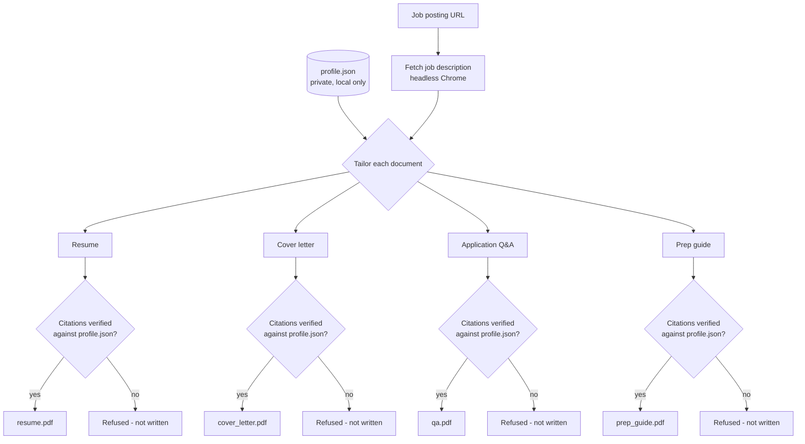

# job-hunt-agent

A personal AI agent that turns one job posting URL into a complete application package — resume, cover letter, application form Q&A, and interview prep guide — using a single structured profile as its only source of truth.

## How it's meant to work

1. **Profile** — all real background facts (experience, projects, skills, links) live in one structured file, `data/profile.json`. This is the only thing the agent is ever allowed to draw facts from.
2. **Fetching** — given a job posting URL, the agent loads the real page (via headless Chrome, so JavaScript-rendered job boards work too) and extracts the actual job description text.
3. **Generating** — four documents get tailored to that specific posting:
   - **Resume** — picks the subset of the profile most relevant to the role. See [`docs/resume-rules.md`](docs/resume-rules.md) for the exact rules every generated resume must follow.
   - **Cover letter** — a one-page letter with two grounded body paragraphs plus a fixed greeting/closing.
   - **Application Q&A** — predicts the free-text questions the application form is likely to ask, with a drafted answer for each one the profile can genuinely answer (personal/logistics questions like salary or notice period are left for you to fill in, never guessed).
   - **Prep guide** — a spoken-style self-introduction plus a handful of key talking points to rehearse before the interview.
4. **Verifying** — every sentence any of these documents write about you carries a citation back to the exact profile field it came from. Before anything is written to disk, that citation is checked against the real profile — if even one doesn't check out, the document is refused, not silently produced with an unverified claim.
5. **Tracking** *(planned)* — logging applications and their status over time.
6. **Autofill** *(planned, later)* — filling out application forms directly, once the safer pieces above are solid.

### The flow, at a glance



## Getting started

These first steps set up the profile and the AI connection. Generating actual documents is step 5, below.

### 1. Install the dependencies

```
python3 -m venv venv
source venv/bin/activate
pip install -r requirements.txt
```

A virtual environment (`venv`) keeps this project's packages separate from anything else on your machine.

### 2. Add your own profile

```
cp data/profile.example.json data/profile.json
```

Open `data/profile.json` and replace the placeholder values with your real details. This file is private by design — it's listed in `.gitignore`, so it never gets committed or pushed, no matter what.

### 3. Set up an AI provider

```
cp .env.example .env
```

Open `.env` and pick one:

- **Cloudflare** (cloud-hosted, free tier with a daily limit) — set `LLM_PROVIDER=cloudflare`, then fill in `CLOUDFLARE_ACCOUNT_ID` and `CLOUDFLARE_API_TOKEN`. Find the account ID under Workers & Pages in your Cloudflare dashboard; create a token under My Profile → API Tokens with "Workers AI" permission.
- **Ollama** (runs on your own computer, no daily limit, slower) — set `LLM_PROVIDER=ollama`, install [Ollama](https://ollama.com), make sure it's running, and pull a model first (e.g. `ollama pull qwen3.5:9b`).

### 4. Confirm it's working

```
python3 src/llm.py
```

A working setup prints something like `LLM (ollama) replied: works`. If something's misconfigured, the error message explains exactly what to check.

### 5. Generate a full application package

```
python3 src/generate.py "<job posting URL>" [output_dir]
```

`output_dir` is optional — it defaults to a folder named after the job's company, derived from the URL (e.g. a Google posting lands in `output/google/`). Each run produces:

```
output/google/
  resume.pdf        resume.html
  cover_letter.pdf   cover_letter.html
  qa.pdf             qa.html
  prep_guide.pdf     prep_guide.html
```

If any document's citations fail verification, that document (and only that one) is refused rather than written with an unverified claim — re-running the command usually succeeds, since the AI's output isn't identical every time.

## Project status

- [x] Profile schema + real data (kept private — see below)
- [x] Resume tailoring rules defined ([`docs/resume-rules.md`](docs/resume-rules.md))
- [x] Job posting fetching (including JavaScript-rendered pages)
- [x] Resume generation, citation-verified
- [x] Cover letter generation, citation-verified
- [x] Application form Q&A generation, citation-verified
- [x] Interview prep guide generation, citation-verified
- [ ] Deeper "honesty check" — catches subtle distortion even when a citation is technically valid (currently only checks that a cited path exists, not that the rewritten text still faithfully matches it)
- [ ] Automatic retry when a generation step fails verification
- [ ] Application tracking
- [ ] Form autofill

## Privacy

`data/profile.json` contains real personal information and is `.gitignore`'d — it never enters git history and is never pushed. `data/profile.example.json` shows the same structure with placeholder data, for reference.

## Why this exists

Built as a learning project — to understand how an AI agent (brain + memory + tools) actually works end to end, one small, reviewed piece at a time, rather than using an off-the-shelf tool.
